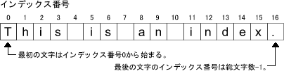

#Stringクラス
Java言語では文字列を扱うデータとしてString型を提供しています。String型は、Javaのクラスライブラリで**String**クラスとして提供されています。 

String型のデータで文字列は、それ自身を書き換えることができません。また、String型は参照型です。 
このため、初期化されたString型の変数に、異なる文字列を再代入すると、元の文字列が書き換えられるのではなく、 
新しい文字列が生成され、変数の参照先がそちらに切り替わります。 

Stringクラスには、String型の変数が指し示す文字列に対し操作をするためのめっそどが多数提供されています。 

構文： 

	String型の変数名.メソッド名();
	
例: 
	
	String	s1="tanaka";
	int num=s1.length();
	
## Stringメソッド

<table>
      <tr align="center" valign="middle"> 
	<td width="48"> 
	  
戻り型

	</td>
	<td width="119"> 
	  
メソッド

	</td>
	<td width="304"> 
	  
説明

	</td>
      </tr>
      <tr align="center" valign="middle"> 
	<td width="48"> 
	  
int

	</td>
	<td width="119"> 
	  
length( )

	</td>
	<td width="304"> 
	  
オブジェクトの保有する文字数を返します。

	</td>
      </tr>
      <tr align="center" valign="middle"> 
	<td width="48"> 
	  
char

	</td>
	<td width="119"> 
	  
charAt(int)

	</td>
	<td width="304"> 
	  
指定されたインデックス番号の位置にある文字を返します。

	</td>
      </tr>
      <tr align="center" valign="middle"> 
	<td width="48"> 
	  
String 
	    String

	</td>
	<td width="119"> 
	  
substring(int) 
	    substring(int, int)

	</td>
	<td width="304"> 
	  
指定されたインデックス番号の位置から終端までの文字列を返します。第2引数が指定されている場合は、第1引数から第2引数までの文字列を返します。

	</td>
      </tr>
      <tr align="center" valign="middle"> 
	<td width="48"> 
	  
int 
	    int

	</td>
	<td width="119"> 
	  
indexOf(String) 
	    lastIndexOf(String)

	</td>
	<td width="304"> 
	  
indexOfでは指定された文字列の最初の出現のインデックス番号を返します。lastIndexOfでは指定された文字列の最後の出現のインデックス番号を返します。

	</td>
      </tr>
      <tr align="center" valign="middle"> 
	<td width="48"> 
	  
boolean 
	    boolean 
	    boolean

	</td>
	<td width="119"> 
	  
endsWith(String) 
	    startsWith(String) 
	    startsWith(String, int)

	</td>
	<td width="304"> 
	  
呼び出したStringオブジェクトの文字列が引数で指定した文字列で終わって（始まって）いればtrueをかえします。第2引数がある場合は、それはStringオブジェクトの文字列の探索を開始する開始点（オフセット）を意味します。

	</td>
      </tr>
      <tr align="center" valign="middle"> 
	<td width="48"> 
	  
int 
	    int

	</td>
	<td width="119"> 
	  
compareTo(String) 
	    compareTo(Object)

	</td>
	<td width="304"> 
	  
呼び出すStringオブジェクトの文字列と引数の値を比較し、等しい場合は0を、Stringオブジェクトの方が大きい場合は正の整数を、小さい場合は負の整数を返します。引数がオブジェクト型の場合はString型に変換され、比較されます。

	</td>
      </tr>
      <tr align="center" valign="middle"> 
	<td width="48"> 
	  
boolean

	</td>
	<td width="119"> 
	  
equals(Object)

	</td>
	<td width="304"> 
	  
呼び出すStringオブジェクトと引数の値を比較し、等しい場合はtrueを返します。

	</td>
      </tr>
      <tr align="center" valign="middle"> 
	<td width="48"> 
	  
String

	</td>
	<td width="119"> 
	  
concat(String)

	</td>
	<td width="304"> 
	  
呼び出すStringオブジェクトの末尾に引数の文字列を付け加えます。

	</td>
      </tr>
      <tr align="center" valign="middle"> 
	<td width="48"> 
	  
String

	</td>
	<td width="119"> 
	  
replace(char, 
	    char)

	</td>
	<td width="304"> 
	  
第1引数で指定された文字を、第2引数で指定された文字に置き換えます。

	</td>
      </tr>
      <tr align="center" valign="middle"> 
	<td width="48"> 
	  
String

	</td>
	<td width="119"> 
	  
trim( )

	</td>
	<td width="304"> 
	  
呼び出すStringオブジェクトの両端の空白文字を削除します。

	</td>
      </tr>
      <tr align="center" valign="middle"> 
	<td width="48"> 
	  
String 
	    String

	</td>
	<td width="119"> 
	  
toLowerCase( 
	    ) 
	    toUpperCase( )

	</td>
	<td width="304"> 
	  
呼び出すStringオブジェクトを小文字（大文字）に変換します。

	</td>
      </tr>
</table>

Stringクラスではインデックス番号を指定して振る舞いを行うメソッドが多数用意されています。 
インデックス番号とはStringオブジェクト内の文字の位置を示すものです。インデックス番号は0から始まり総文字列数－１まであります。 

【例１】indexOfメソッドを使用し、キーワード「index」が含まれるindex番号を取得し、逆にsubstringメソッドを使用し、 
取得したindex番号を指定してキーワード「index」を表示させることができるかを検証するプログラム 

	public class ExString3 {
	  public static void main(String[] args) {
	    String aaa = "This is an index.";   //(1)
	    int point = aaa.indexOf("index");   //(2)
	    String answerIndex = aaa.substring(point);   //(3)
	    System.out.println(answerIndex);   //(4)
	  }
	}

【解説１】
1. Stringオブジェクトaaaの生成を行います。 
2. indexOfメソッドを使用して、aaaオブジェクト中のキーワード「index」が出現するインデックス番号を変数pointに代入します。 
3. substringメソッドの引数に変数pointを指定し、変数pointで指定されたインデックス番号以降の文字列を変数answerIndexに代入します。 
4. printlnメソッドで変数answerIndexに代入された文字列の表示を行います。 

concatメソッド、replaceメソッドなどStringクラスにはStringオブジェクトの文字列を変更する多くの便利なメソッドが用意されています。 
しかしこれらはStringオブジェクトそのものを変更すると言うのではありません。 
なぜならStringオブジェクトは一度値が代入されるとその値を変更することができないためです。 
concat、replaceなどStringオブジェクトを変更するかのように見えるメソッドを使用した場合は、 
変更された新たなStringオブジェクトが生成されると言うことになります。 

【例２】concatメソッドを使用し、キーワード「Hanshin」とキーワード「Tigers」を連携させるプログラムです。 

	public class ExString4 {
	  public static void main(String[] args) {
	    String firstHalf = "Hanshin";   //(1)
	    String latterHalf = "Tigers";   //(2)
	    // 両キーワードをconcatメソッドで連結
	    System.out.println(firstHalf.concat(latterHalf));   //(3)
	  }
	}

【解説２】
1. キーワード「Hanshin」を代入したオブジェクトfirstHalfを生成します。 
2. キーワード「Tigers」を代入したオブジェクトlatterHalfを生成します。 
3. concatメソッドを使用し、両オブジェクトを連結し、その内容をprintlnメソッドで表示します。 

#StringBuilderクラス
**StringBuilder**クラスも文字列を扱うクラスですが、**変数に格納した文字列を変更することが可能**です。 
(単一スレッドで使うことを前提としたStringBufferクラスの代わりのクラスとなっており、StringBufferクラスより高速ということです)。 
Stringクラスとの違いは、Stringクラスは本来固定の文字列となっており一度作成すると変更は出来ません。 
「+」演算子を使って文字列の連結を行う場合には、内部的にStringBuilderクラス(又はStringBufferクラス)を使って行われています。 
このように文字列連結を行う時にはいったんStringBuilderクラスに内部で変換が行われて処理されるため、 
文字列の連結が多数行われる場合には最初からStringBuilderクラスを使ったほうが高速に行われます。 

## 文字列を追加する(append)

まずStringBuilderクラスの使い方から見ておきます。Stringクラスを使って文字列を連結するというのは例えば下記のようなことです。 

	String str = "abc" + "def" + "ghi";
	
Stringクラスのオブジェクトである文字列は、「+」演算子を使って文字列と文字列をつなげることが出来ます。 
上記の場合であれば「abc」という文字列に「def」という文字列を最後に追加した新しい文字列を作成します。 
さらにその新しい文字列の最後に「ghi」とい文字列を追加して新しい文字列を作成しています。 

これはStringクラスが本来固定長であるためで、一度作成した文字列に後から文字を追加することが出来ないため、 
2つの文字列を結合した値を持つ新しい文字列を作成しているわけです。 
これに対してStringBuilderクラスは可変長の文字列を扱うクラスで、新しくオブジェクトを作成することなく随時文字列を追加することが出来ます。 

その為、文字列を連結する処理が多い場合には、最初からStringBuilderクラスで文字列の連結を行っておき、 
最後にStringBuilderクラスのオブジェクトからStringクラスのオブジェクトを作成することで効率よく文字列の連結が行えます。 

ここではまず作成したStringBuilderクラスのオブジェクトに文字列を追加するためのメソッドを確認します。 

	append
	public StringBuilder append(String str)
	指定された文字列をこの文字シーケンスに追加します。

String 引数の文字が、順番にこのシーケンスに追加されます。その結果、引数の長さの分だけこのシーケンスの長さが増えます。 
str が null の場合、"null"の 4 文字が追加されます。 

	パラメータ:
	  str - 文字列 
	戻り値:
	  このオブジェクトへの参照
	  
現在StringBuilderクラスのオブジェクトに格納されている文字列の最後に引数で指定した文字を追加します。 
StringBuilderクラスのオブジェクトの作成から文字列の追加、そして最後にStringクラスの作成までの一連の流れは下記のようになります。 

	StringBuilder sb = new StringBuilder();
	sb.append("abc");
	sb.append("def");
	sb.append("ghi");
	
	Strint str = new String(sb);  // "abcdefghi"
	
上記のappendメソッドの引数はString型となっていますが、同じメソッドで引数の型が違うメソッドが用意されています。 

	StringBuilder append(boolean b)
	StringBuilder append(char c)
	StringBuilder append(char[] str)
	StringBuilder append(char[] str, int offset, int len)
	StringBuilder append(CharSequence s)
	StringBuilder append(CharSequence s, int start, int end)
	StringBuilder append(double d)
	StringBuilder append(float f)
	StringBuilder append(int i)
	StringBuilder append(long lng)
	StringBuilder append(Object obj)
	StringBuilder append(StringBuffer sb)
	
String型以外の値の場合は、いったん文字列表現の形に変更されてから追加されて行きます。 
ほとんどの型について用意されていますので、あまり型を気にすることなく値を追加していく事が出来ます。(文字列の「+」の連結で文字列と数字の連結なども出来るのはこのためです)。 

## 文字列を挿入する(insert)
指定した位置に文字列を挿入するメソッドを確認します。

	insert
	public StringBuilder insert(int offset, String str)
	文字列をこの文字シーケンスに挿入します。

String 引数の文字が、このシーケンスの指定されたオフセット位置に順番に挿入されます。その位 
置にあった文字は移動され、引数の長さの分だけこのシーケンスの長さが増加します。str が null 
の場合は、"null" の 4 文字がこのシーケンスに挿入されます。  

offset 引数は 0 以上で、このシーケンスの長さに等しいかこれより小さくなければなりません。 

	パラメータ:
	  offset - オフセット
	  str - 文字列 
	戻り値:
	  このオブジェクトへの参照 
	例外: 
	  StringIndexOutOfBoundsException - オフセットが無効な場合
	  
appendメソッドは最後に文字列を追加しましたが、insertメソッドは指定した位置に文字列を挿入します。 
挿入する位置を表すオフセットは先頭が0となります。またバイト数ではなく文字数での位置となりますので半角文字も全角文字も同じ扱いとなります。 

上記のinsertメソッドの引数はString型となっていますが、同じメソッドで引数の型が違うメソッドが用意されています。 

	StringBuilder insert(int offset, boolean b)
	StringBuilder insert(int offset, char c)
	StringBuilder insert(int offset, char[] str)
	StringBuilder insert(int index, char[] str, int offset, int len)
	StringBuilder insert(int dstOffset, CharSequence s)
	StringBuilder insert(int dstOffset, CharSequence s, int start, int end)
	StringBuilder insert(int offset, double d)
	StringBuilder insert(int offset, float f)
	StringBuilder insert(int offset, int i)
	StringBuilder insert(int offset, long l)
	StringBuilder insert(int offset, Object obj)
	
appendメソッドと同じくString型以外の値の場合は、いったん文字列表現の形に変更されてから挿入されて行きます。 

## StringBuilder他のメソッド

<table>
	<caption>【java.lang.StringBuilderクラスの主要メソッド】</caption>
	<thead>
		<tr>
		<th>戻値型</th>
		<th>メソッド</th>
		<th>説明</th>
		</tr>
	</thead>
<tbody>
	<tr>
		<td>StringBuilder</td>
		<td>append(String s)</td>
		<td>末尾にsを追加する （※引数はintやcharなどもOKです。）</td>
	</tr>
	<tr>
		<td>StringBuilder</td>
		<td>insert(int x, String s)</td>
		<td>a番目にsを挿入する （※引数はintやcharなどもOKです。）</td>
	</tr>
	<tr>
		<td>StringBuilder</td>
		<td>replace(int a, int b, String s)</td>
		<td>a番目～b番目の文字をsに置き換える</td>
	</tr>
	<tr>
		<td>void</td>
		<td>setCharAt(int a, char s)</td>
		<td>a番目の文字をsに置き換える</td>
	</tr>
	<tr>
		<td>StringBuilder</td>
		<td>delete(int a, int b)</td>
		<td>a番目～b番目の文字を削除する</td>
	</tr>
	<tr>
		<td>StringBuilder</td>
		<td>deleteCharAt(int a)</td>
		<td>a番目の文字を削除する</td>
	</tr>
	<tr>
		<td>char</td>
		<td>charAt(int a)</td>
		<td>a番目の文字をchar型で取得する</td>
	</tr>
	<tr>
		<td>int</td>
		<td>indexOf(String s)</td>
		<td>sが一番最初に出現するインデックス番号を返す （存在しない場合は -1 が返る）</td>
	</tr>
	<tr>
		<td>int</td>
		<td>indexOf(String s, int a)</td>
		<td>sがa番目以降で一番最初に出現するインデックス番号を返す （存在しない場合は -1 が返る）</td>
	</tr>
<tr><td>int</td><td>lastIndexOf(String s)</td><td>sが最後に出現するインデックス番号を返す （存在しない場合は -1 が返る）</td></tr>
<tr><td>int</td><td>lastIndexOf(String s, int a)</td><td>sがa番目より手前で一番最初に出現するインデックス番号を返す （存在しない場合は -1 が返る）</td></tr>
<tr><td>int</td><td>length()</td><td>文字列の長さ（文字数）を返す</td></tr>
<tr><td>StringBuilder</td><td>reverse()</td><td>文字列の並びを逆にする</td></tr>
<tr><td>String</td><td>substring(int a)</td><td>a番目以降をString型で返す</td></tr>
<tr><td>String</td><td>substring(int a, int b)</td><td>a番目～b番目をString型で返す</td></tr>
<tr><td>void</td><td>toString()</td><td>String型で返す</td></tr>
</tbody>
</table>

#### 例:

	//元データ
	StringBuilder sb1 = new StringBuilder("ABCDEFG");
	StringBuilder sb2 = new StringBuilder("ABCDEABCDEABCDE");
	StringBuilder sb3 = new StringBuilder("あいうえお");
	
	※以下の結果は全てtoStringしたものです
	
	//末尾に"***"を付加する
	sb1.append("***");
	→ "ABCDEFG***"
	
	//インデックス番号1（２文字目）に"***"を挿入する
	sb1.insert(1, "***");
	→ "A***BCDEFG"
	
	//インデックス番号2～4（３～４文字目）を"***"に置換する
	sb1.replace(2, 4, "***");
	→ "AB***EFG"
	
	//インデックス番号3（４文字目）を'*'に置換する
	sb1.setCharAt(3, '*');
	→ "ABC*EFG"
	
	//インデックス番号0～2（１～２文字目）を削除する
	sb1.delete(0,2);
	→ "CDEFG"
	
	//インデックス番号3（４文字目）を削除する
	sb1.deleteCharAt(3);
	→ "ABCEFG"
	
	//インデックス番号3（４文字目）を取得する
	sb1.charAt(3)
	→ 'D'
	
	//"CD"が一番最初に出現するインデックス番号を取得する
	sb2.indexOf("CD")
	→ 2
	sb2.indexOf("HOGE")
	→ -1　（見つからないので-1）
	
	//インデックス番号5（６文字目）以降で
	　"CD"が最初に出現するインデックス番号を取得する
	sb2.indexOf("CD", 5)
	→ 7
	
	//"CD"が一番最後に出現するインデックス番号を取得する
	sb2.lastIndexOf("CD")
	→ 12
	
	//インデックス番号10（１１文字目）以前で
	　"CD"が最後に出現するインデックス番号を取得する
	sb2.lastIndexOf("CD", 10)
	→ 7
	
	//文字数を取得する
	sb1.length();
	→ 7
	sb3.length();
	→ 5
	
	//文字列の並びを反転させる
	sb1.reverse();
	→ "GFEDCBA"
	
	//インデックス番号3（４文字目）以降の文字列を取得する
	sb1.substring(3)
	→ "DEFG"
	
	//インデックス番号0～3（１～３文字目）の文字列を取得する
	sb1.substring(0, 3);
	→ "ABC"
	
	//StringBuilderをString型で取得する
	sb1.toString();
	→ "ABCDEFG"
	
	
