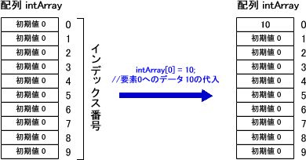
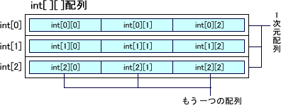
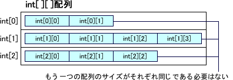

# 配列

## 1.一次元配列(Array)

### 配列とは
同じ目的使用される�}数の��を格�{するのに便利なのが配列です。 
プログラムの中で��を一�r的に保存しておきたい�龊稀��涫�を使うことで可能です。 
ただ例えば生徒数十人のテストの点数を保存するために�涫�を生徒の数だけ用意しようとするとプログラムが不必要に分かりにくくなります。 
また保存した��の平均を��算しようとした�龊悉恕��涫�を全て一つずつ加算して人数で割るといった��述が必要となります。 
配列は�涫�に似ていますが、�涫�が一つの��を保管するのに��して配列では�}数の��を保管することができます。 
配列を利用することで、似たような名前の�涫�を大量に作らなくても�gみ、 
 また配列内の�}数の�����鏊�に格�{された��を��番に�I理するといったことが可能になります。 
ここではJavaにおける配列の使い方について�_�Jしていきます。 

### 配列の作成
配列を使用するには、まず最初に使用する配列を宣言しなくてはいけません。宣言は次のように行います。 

    `型名 配列�涫�名[]; //配列の宣言`

�涫�の�龊悉韧�じく格�{される��のデ�`タ型と、配列を区�eするための配列�涫�名を指定します。 
一つの配列には同じデ�`タ型の��しか格�{することはできません。 
配列�涫�名の付け方については**�R�e子**の�龊悉韧�じです。 

�涫�の�龊悉闲�言するだけで一つの��を格�{できる�鏊�が�_保されましたが、 
配列の�龊悉扦���を格�{する�鏊�を必要な数だけ後から�_保する必要があります。 
�鏊�を�_保するにはnew演算子を使って次のように行います。 

    型名 配列�涫�名[];　　　　　　　　//配列の宣言
    配列�涫�名 = new 型名[要素数];　//�I域�_保

一つの配列に�_保される一つ一つの�鏊�を要素と呼びます。 
new演算子では型名の後の「**\[**」から「**\]**」の�gに要素の数である要素数を指定して格�{する�鏊�である要素を�_保し、 
それを配列�涫�に代入します。これで配列は要素数の数だけの��を格�{することができるようになります。 

なお配列の宣言と要素の�_保はまとめて次のように��述することもできます。 

    型名 配列�涫�名[] = new 型名[要素数];

例えばint型の��を5つ格�{できる配列を用意するには次のように��述します。 

    int a[];
    a = new int[5];
    int b[] = new int[5];

上は配列の宣言と要素の�_保を�e々に行った�龊稀⑾陇弦�素の宣言と配列の�_保をまとめて行った�龊悉扦埂� 

配列の宣言の�eの方法 

Javaでは先に��述した��述方法の他に次の��式を使うことができます。 

    型名[] 配列�涫�名;

どちらの��式であっても配列の宣言に�`いはありません。 どちらかの方法で�y一して使うようにしていればいいと思います。 
ただどちらかの��式では��述しにくい�rもありますので二つの��述方法があることは��えておいて下さい。 
この��式を使ってint型の��を5つ格�{できる配列を用意するには次のように��述します。 

    int[] a;
    a = new int[5];
    int[] b = new int[5];

### 添え字(インデックス、index)
配列名の宣言、�I域の�_保は、あくまで��を入れる���浃扦埂� 

配列はインデックス番号を使用して、配列の各要素の指定を行います。 
インデックス番号は**０**から始まり**(配列�L－１)**までとなります。 
配列の各要素へのデ�`タの代入、代入されたデ�`タの参照を行う�龊悉悉饯我�素を表すインデックス番号を指定して行います。 

### 配列の初期化
宣言した配列を使い始める前に、�I域の�_保、��(初期��)の代入まで最初に 
行っておくことを、**配列の初期化**と呼びます。��を**{}**で�欷摺⒏饕�素 
は**カンマ**で区きりする。 
また、作成した配列の要素数を�{べるには**length**を使用する。 

*��文*

    デ�`タ型[]={初期��1,初期��2,初期��3,...,初期��n};
    配列名.length;  //要素数を�@得する

*例*

    int[] id={100,101,102,103,104};
    int size=id.length; //sizeには5を格�{する

### 配列要素の初期化

基本デ�`タ型の�涫�の�龊悉稀⒚魇镜膜���を代入しないと利用することが出来ません。 
省略�rの��が自�拥膜舜�入されたりはしません。 

配列はオブジェクトの一つの型です。 
オブジェクトを参照する参照型�涫�の�龊悉稀⒚魇镜膜���を代入しなくとも、 
省略�rの��が予め�Qめられており、自�拥膜舜�入されます。 
参照型�涫�の省略�rの��（デフォルト��）は null です。 何も参照していないことを明示します。 
<table>
<tr><td>byte</td><td>0</td></tr>
<tr><td>short</td><td>0</td></tr>
<tr><td>int</td><td>0</td></tr>
<tr><td>long</td><td>0L</td></tr>
<tr><td>float</td><td>0.0F</td></tr>
<tr><td>double</td><td>0.0</td></tr>
<tr><td>char</td><td>'\u0000'</td></tr>
<tr><td>boolean</td><td>false</td></tr>
<tr><td>参照型</td><td>null</td></tr>
</table>

**ここで�h明した配列のように、1��の添字で管理された配列のことを、1次元配列と呼びます。** 

## 2.多次元配列
Java言�Zでは1次元配列の他に、添字を2��で管理する**2次元配列**、それ以上の**多次元配列** 
もサポ�`トしています。 

### 概要
Javaでは2次元配列は配列の配列という形をとっています。つまり1次元配列の各要素にもう一つの配列があると言う形です。 

もう一つの配列のサイズがそれぞれ同じである必要はありません。 
但し、デ�`タ管理が�}�jになるため、あまりお�幛幛悉扦�ません 

### 2次元配列の宣言?生成
2次元配列も1次元配列と同��に配列の宣言、宣言した配列オブジェクトに��する生成という手��をとります。 
2次元配列は上位配列（1次元配列）と下位配列（1次元配列の中の配列）を同�rに生成することもできますし、 
�e々に生成することもできます。 
上位配列と下位配列を�e々に生成する�龊悉细骰嘏淞肖违单ぅ氦�同じでない�龊悉胜嗓耸褂盲筏蓼埂� 

**【例１】上位配列と下位配列を同�rに生成する�龊稀�**

    int[][] int2Array = new int[10][5];
    //int型の2次元配列int2Arrayを宣言?生成。
    //上位配列のサイズは10、下位配列のサイズは5です。

    String[][] string2Array = { {"Sunday", "Monday"},
                                {"Monday", "Tuesday"} };
    //初期化子を指定して2次元配列を宣言?生成することもできます。

**【例２】上位配列と下位配列を�e々に生成する�龊稀�**

    double[][] double2Array = new double[5][];
    //double型の2次元配列double2Arrayを宣言し、上位配列のみを生成。

    double2Array[0] = new double[10];
    double2Array[1] = new double[8];
    double2Array[2] = new double[9];
    double2Array[3] = new double[8];
    double2Array[4] = new double[9];
    //下位配列のみを生成。