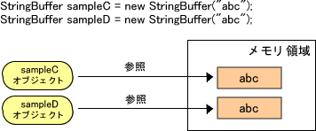
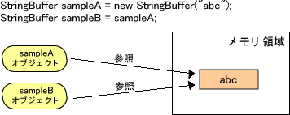

# 2.比�^演算子

**�v�S演算子**は、2つの��を比�^する�Hに使用します。�v�S演算子を使用した�Y果は 
**boolean��**である**true**もしくは**false**がかえります。�兢盲啤�trueの�r 
とfalseの�rに行いたい�I理を分岐したい�龊悉胜嗓颂跫�文と�Mみ合わせて使用されます。 

## 概要
比�^演算子には以下の演算子が用意されています。 
<table>
<tr align="center" valign="middle">
  <td>
    
演算子

  </td>
  <td>
    
��入例

  </td>
  <td>
    
�h明

  </td>
</tr>
<tr align="center" valign="middle">
  <td>
    
>

  </td>
  <td>
    
x > y

  </td>
  <td>
    
xがyよりも大きい�龊悉�trueを返す。

  </td>
</tr>
<tr align="center" valign="middle">
  <td>
    
>=

  </td>
  <td>
    
x >= y

  </td>
  <td>
    
xがyよりも大きいか等しい�龊悉�trueを返す。

  </td>
</tr>
<tr align="center" valign="middle">
  <td>
    
&lt;

  </td>
  <td>
    
x < y

  </td>
  <td>
    
xがyよりも小さい�龊悉�trueを返す。

  </td>
</tr>
<tr align="center" valign="middle">
  <td>
    
<=

  </td>
  <td>
    
x <= y

  </td>
  <td>
    
xがyよりも小さいか等しい�龊悉�trueを返す。

  </td>
</tr>
<tr align="center" valign="middle">
  <td>
    
==

  </td>
  <td>
    
x == y

  </td>
  <td>
    
xとyが等しい�龊悉�trueを返す。

  </td>
</tr>
<tr align="center" valign="middle">
  <td>
    
!=

  </td>
  <td>
    
x != y

  </td>
  <td>
    
xとyが等しくない�龊悉�trueを返す。

  </td>
</tr>
<tr align="center" valign="middle">
  <td>
    
instanceof

  </td>
  <td>
    
x instanceof
      y

  </td>
  <td>
    
xがyと同じクラスかyのサブクラスである�龊悉�trueを返す。

  </td>
</tr>
</table>

**【例１】�v�S演算子を使用した基本的な使用方法を例示します。**

    public class ExOperator4 {
      public static void main(String[] args) {
        int x = 10;   //(1)
        float y = 10.05F;   //(2)

        if ( y > x ) {   //(3)
          System.out.println("y > xはtrueです。");
        }

        if ( y >= x ) {    //(4)
          System.out.println("y >= xはtrueです。");
        }

        if ( x < y ) {    //(5)
          System.out.println("x < yはtrueです。");
        }

        if ( x <= y ) {    //(6)
          System.out.println("x <= yはtrueです。");
        }
      }
    }

【解�h１】 
1.int型�涫�xに��10を代入します。 
2.float型�涫�yに��10.05を代入します。 
3.y > xの�Y果がtrueであるためifブロック内のprintlnメソッドを�g行します。 
4.y >= xの�Y果がtrueであるためifブロック内のprintlnメソッドを�g行します。 
5.x < yの�Y果がtrueであるためifブロック内のprintlnメソッドを�g行します。 
6.x <= yの�Y果がtrueであるためifブロック内のprintlnメソッドを�g行します。 

【�g行�Y果１】 

    D:\JAVA>javac ExOperator4.java

    D:\JAVA>java ExOperator4
    y > xはtrueです。
    y >= xはtrueです。
    x < yはtrueです。
    x <= yはtrueです。

    D:\JAVA>

## ==、!=の利用について

ここでは、==、!=を使用する�Hの注意点について�h明します。 
Javaのデ�`タ型には大きく分けて**基本デ�`タ型(プリミティブ型)**と**オブジェクト型(参照型)** の2つがあります。 
基本型に��して==、!=を使用する�Hは特に���}はありませんが、オブジェクト型に��して使用する�Hは注意が必要です。 
==、!=をオブジェクト型に��して使用する�龊稀�オブジェクトが保有する��を比�^しているのではなく、オブジェクトが参照する参照元が同じか 
を比�^していると言う点を意�Rする必要があります。オブジェクトが保有する��を比�^したい�龊悉�equalsメソッドを使用します。 

【参照元が同じケ�`ス】

【��は同じだが参照元が��なるケ�`ス】

【例２】オブジェクト型デ�`タに��して、 
参照元が同じケ�`スとオブジェクトの��は同じだが参照元が��なるケ�`スの==演算子の振る舞いの�`いについて例示します。 

    public class ExOperator5 {
      public static void main(String[] args) {
        StringBuffer sampleA = new StringBuffer("abc");   //(1)
        StringBuffer sampleB = sampleA;   //(2)
        System.out.println
          ("sampleAとsampleBは" + (sampleA == sampleB));   //(3)

        StringBuffer sampleC = new StringBuffer("abc");   //(4)
        StringBuffer sampleD = new StringBuffer("abc");   //(5)
        System.out.println
          ("sampleCとsampleDは" + (sampleC == sampleD));   //(6)
      }
    }

【解�h２】 
1.new演算子にてオブジェクトsampleAの生成を行います。 
2.代入演算子=にてオブジェクトsampleAをオブジェクトsampleBにコピ�`します。 この�龊稀⑿陇郡衰幞猊觐I域にsampleBの�I域が�_保されるのではなく、sampleAの参照情�螭韦撙�sampleBにコピ�`されます。
3.sampleAとsampleBを==演算子にて比�^を行います。参照元が同じのため、trueが返されます。 
4.new演算子にてオブジェクトsampleCの生成を行います。 
5.new演算子にてオブジェクトsampleDの生成を行います。 
6.sampleCとsampleDを==演算子にて比�^を行います。��abcは同じだが、参照元が��なるためfalseが返されます。 

【�g行�Y果２】 

    D:\JAVA>javac ExOperator5.java

    D:\JAVA>java ExOperator5
    sampleAとsampleBはtrue
    sampleCとsampleDはfalse

    D:\JAVA>

## instanceofの利用について

ここではinstanceofの使用方法について�h明をします。
 instanceofは左オペランドが右オペランドと同じクラスかそのサブクラスであるかを�{べる演算子です。 
左オペランドには任意のオブジェクト参照式(�涫�など)、右オペランドにはクラス?インタフェ�`ス?配列の型が入ります。 
具体的な使用方法については以下の例を参照してください。※オペランドとは演算子が演算��象とするものの意味。

【例３】左オペランドのオブジェクト型�涫�class1の��が右オペランドのExOperator6クラスと 
同じクラスもしくはサブクラスであるかをinstanceof演算子を使用して�{べます。 

    public class ExOperator6 {
      public static void main(String[] args) {
        sub_ExOperator6 class1 = new sub_ExOperator6();   //(1)

        if (class1 instanceof ExOperator6) {   //(2)
         System.out.println("class1はExOperator6クラスに属します。");
        } else {
         System.out.println("class1はExOperator6クラスに属しません。");
        }
      }
    }

    public class sub_ExOperator6 extends ExOperator6 { }

【解�h３】 
1.sub_ExOperator6クラスの��をもつ、オブジェクト�涫�class1を宣言?生成します。
2.オブジェクト�涫�class1がExOperator6クラスと同じクラスもしくはサブクラスであるかを instanceof演算子を使用して�{べます。 
class1が保有するデ�`タ型sub_ExOperator6クラスはExOperator6クラスのサブクラスであるため、trueが返されます。 

【�g行�Y果３】 

    D:\JAVA>javac ExOperator6.java

    D:\JAVA>java ExOperator6
    class1はExOperator6クラスに属します。

    D:\JAVA>

